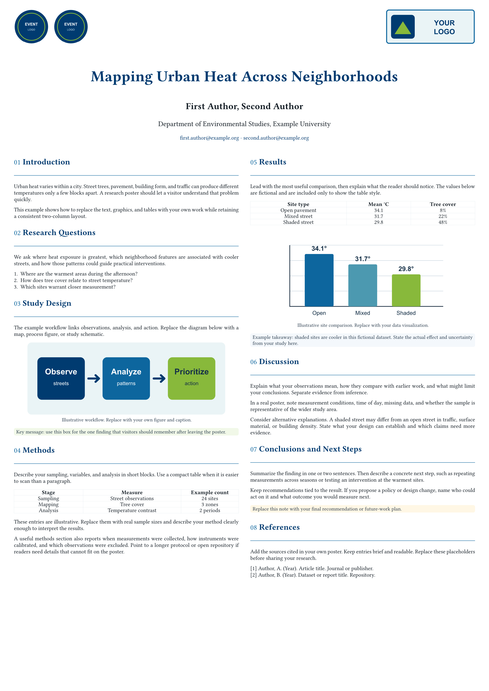

Aurora Poster is a reusable A0 portrait research poster for conference sessions,
university showcases, and other large-format academic presentations. It keeps
the source poster's two-column structure, numbered navy headings, compact
tables, figures, and colored takeaway boxes. The included starter uses clearly
marked fictional data and original placeholder artwork.



## Start a poster

After the package is published on Typst Universe, initialize a project with:

```sh
typst init @preview/aurora-poster:0.1.0 my-poster
cd my-poster
typst compile main.typ
```

The created project contains `main.typ` and `assets/`. Edit `main.typ` to replace
the sample title, authors, contact details, sections, tables, figures, and
references. Replace the SVG files in `assets/` with your own images, or change
the `image(...)` calls to point to your files. The sample figures and values are
not research results.

You can also import the styling into an existing Typst document:

```typst
#import "@preview/aurora-poster:0.1.0": poster, poster-columns, poster-section, callout

#show: poster.with(
  title: [A concise research title],
  authors: [First Author, Second Author],
  affiliations: [Your institution],
  contact: [contact\@example.org],
  institution-logo: image("assets/my-logo.svg", height: 60mm),
)

#poster-columns(
  [
    #poster-section("01", "Introduction")[Your context and question.]
    #poster-section("02", "Methods")[Your method and figures.]
  ],
  [
    #poster-section("03", "Results")[Your key results.]
    #callout[Your one-sentence takeaway.]
  ],
)
```

Pass logos and other images as `image(...)` content to `poster`. Paths then
resolve from your document, so replacing an asset in the initialized project
works as expected.

## Customize the layout

`poster` is a show-rule function. It accepts the following named arguments:

| Argument | Default | Use |
| --- | --- | --- |
| `title`, `authors`, `affiliations`, `contact` | Sample title or empty content | Header text |
| `event-logos`, `institution-logo` | `none` | Optional image or other Typst content |
| `paper-width`, `paper-height` | `841mm`, `1189mm` | A0 portrait page size |
| `font` | `"Libertinus Serif"` | Font family for the poster |
| `title-color`, `text-color` | Navy, dark ink | Header and body colors |
| `title-size`, `body-size` | `75pt`, `27pt` | Main type scale |
| `author-size`, `meta-size`, `contact-size` | `45pt`, `35pt`, `27.5pt` | Header type scale |
| `caption-size` | `24pt` | Figure-caption size |

`poster-columns(left, right, gutter: 20mm)` places two content blocks side by
side. Move sections between the two arguments to rebalance a poster. If content
extends past the A0 page, shorten it or adjust the type sizes and figure widths.

`poster-section(number, title, body, title-color: ..., rule-color: ...)` draws
a numbered heading and divider. Use `callout(body, fill: ...)` for highlighted
findings. Both helpers accept ordinary Typst content, so tables, figures, math,
and links can be placed inside a section.

The default `Libertinus Serif` font is available with Typst, so no extra font
installation is required. If you prefer the source poster's requested
`Libertinus Sans`, install that font in your Typst environment and pass
`font: "Libertinus Sans"` to `poster.with(...)`. Other installed fonts can be
used the same way. Changing the page dimensions may require changing type sizes
and image widths to keep the layout balanced.

## Before Universe publication

The `@preview/aurora-poster:0.1.0` import is the final public import path. It
becomes downloadable only after Typst Universe accepts the package. To test a
checkout before publication, copy the repository into a local package path at
`preview/aurora-poster/0.1.0`, then compile the starter with
`typst compile --package-path <package-path> template/main.typ`. You can also
run `typst init @preview/aurora-poster:0.1.0 --package-path <package-path>`
against that local copy.

## License

The template code and included placeholder assets are licensed under the
[MIT License](LICENSE). Replace the generic logos before publishing a poster
for an institution or event.
